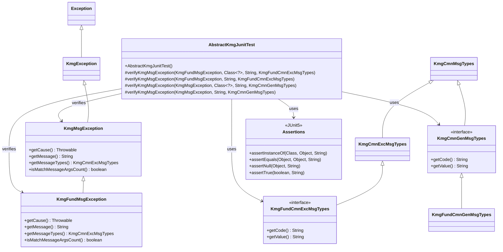
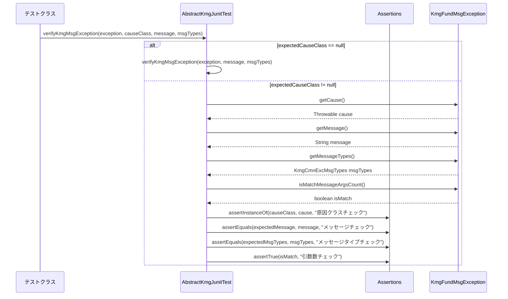
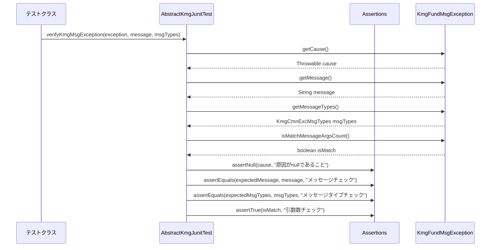

# インフラストラクチャ層テスト層の設計書

## 1. 概要

テスト層は、KMG JavaFX プロジェクトの JUnit テストの共通機能を提供します。
KMG 基盤（Foundation）の例外クラスと KMG コアの例外クラスの検証メソッドを提供し、テストの一貫性と保守性を向上させます。

## 2. パッケージ構成

```text
kmg.javafx.infrastructure.test
├── AbstractKmgJunitTest.java
└── package-info.java
```

## 3. クラス図



## 4. AbstractKmgJunitTest の詳細

### 4.1 概要

KMG JavaFX プロジェクトの JUnit テストの抽象基底クラスです。
KMG 基盤と KMG コアの例外クラスの検証メソッドを提供し、テストコードの一貫性と保守性を向上させます。

### 4.2 フィールド

このクラスにはフィールドは定義されていません。

### 4.3 コンストラクタ

#### 4.3.1 デフォルトコンストラクタ

```java
public AbstractKmgJunitTest()
```

デフォルトコンストラクタです。処理はありません。

### 4.4 メソッド

#### 4.4.1 KmgFundMsgException の検証（原因クラス指定版）

```java
protected void verifyKmgMsgException(
    final KmgFundMsgException actualException,
    final Class<?> expectedCauseClass,
    final String expectedDomainMessage,
    final KmgFundCmnExcMsgTypes expectedMessageTypes)
```

KMG 基盤メッセージ例外の検証を行います。期待する原因のクラスが null の場合は、null であることを検証します。

**パラメータ:**

- `actualException`: 実際の例外
- `expectedCauseClass`: 期待する原因のクラス
- `expectedDomainMessage`: 期待するドメインメッセージ
- `expectedMessageTypes`: 期待するメッセージの種類

**処理内容:**

1. 期待する原因のクラスが null かチェック
2. null の場合は、原因クラスなし版のメソッドを呼び出し
3. そうでない場合は、以下の検証を実施：
   - 原因クラスの型チェック（`Assertions.assertInstanceOf`）
   - ドメインメッセージの一致チェック（`Assertions.assertEquals`）
   - メッセージタイプの一致チェック（`Assertions.assertEquals`）
   - メッセージ引数の数の一致チェック（`Assertions.assertTrue`）

#### 4.4.2 KmgFundMsgException の検証（原因クラスなし版）

```java
protected void verifyKmgMsgException(
    final KmgFundMsgException actualException,
    final String expectedDomainMessage,
    final KmgFundCmnExcMsgTypes expectedMessageTypes)
```

KMG 基盤メッセージ例外の検証を行います。実際の例外の原因のクラスが null であることを検証します。

**パラメータ:**

- `actualException`: 実際の例外
- `expectedDomainMessage`: 期待するドメインメッセージ
- `expectedMessageTypes`: 期待するメッセージの種類

**処理内容:**

1. 原因が null であることを検証（`Assertions.assertNull`）
2. ドメインメッセージの一致チェック（`Assertions.assertEquals`）
3. メッセージタイプの一致チェック（`Assertions.assertEquals`）
4. メッセージ引数の数の一致チェック（`Assertions.assertTrue`）

#### 4.4.3 KmgMsgException の検証（原因クラス指定版）

```java
protected void verifyKmgMsgException(
    final KmgMsgException actualException,
    final Class<?> expectedCauseClass,
    final String expectedDomainMessage,
    final KmgCmnGenMsgTypes expectedMessageTypes)
```

KMG コアメッセージ例外の検証を行います。期待する原因のクラスが null の場合は、null であることを検証します。

**パラメータ:**

- `actualException`: 実際の例外
- `expectedCauseClass`: 期待する原因のクラス
- `expectedDomainMessage`: 期待するドメインメッセージ
- `expectedMessageTypes`: 期待するメッセージの種類

**処理内容:**

1. 期待する原因のクラスが null かチェック
2. null の場合は、原因クラスなし版のメソッドを呼び出し
3. そうでない場合は、以下の検証を実施：
   - 原因クラスの型チェック（`Assertions.assertInstanceOf`）
   - ドメインメッセージの一致チェック（`Assertions.assertEquals`）
   - メッセージタイプの一致チェック（`Assertions.assertEquals`）
   - メッセージ引数の数の一致チェック（`Assertions.assertTrue`）

#### 4.4.4 KmgMsgException の検証（原因クラスなし版）

```java
protected void verifyKmgMsgException(
    final KmgMsgException actualException,
    final String expectedDomainMessage,
    final KmgCmnGenMsgTypes expectedMessageTypes)
```

KMG コアメッセージ例外の検証を行います。実際の例外の原因のクラスが null であることを検証します。

**パラメータ:**

- `actualException`: 実際の例外
- `expectedDomainMessage`: 期待するドメインメッセージ
- `expectedMessageTypes`: 期待するメッセージの種類

**処理内容:**

1. 原因が null であることを検証（`Assertions.assertNull`）
2. ドメインメッセージの一致チェック（`Assertions.assertEquals`）
3. メッセージタイプの一致チェック（`Assertions.assertEquals`）
4. メッセージ引数の数の一致チェック（`Assertions.assertTrue`）

## 5. シーケンス図

### 5.1 KmgFundMsgException の検証（原因クラス指定版）



### 5.2 KmgFundMsgException の検証（原因クラスなし版）



## 6. 使用例

### 6.1 テストクラスの継承

```java
@SuppressWarnings({
    "nls", "static-method",
})
public class SampleServiceTest extends AbstractKmgJunitTest {

    @Test
    public void testProcess_normalSuccess() {
        // 正常系のテスト
    }

    @Test
    public void testProcess_errorFileNotFound() {
        /* 期待値の定義 */
        final String expectedMessage = "[KMGFUND_GEN24000] 該当するYAMLファイルがありません。ファイルパス=[/path/to/file.yml]";
        final KmgFundCmnExcMsgTypes expectedMessageTypes = KmgFundGenMsgTypes.KMGFUND_GEN24000;

        /* 準備 */
        final SampleService testService = new SampleService();
        final String testFilePath = "/path/to/file.yml";

        /* テスト対象の実行 */
        final KmgFundMsgException testException = Assertions.assertThrows(
            KmgFundMsgException.class,
            () -> testService.process(testFilePath)
        );

        /* 検証の実施 */
        this.verifyKmgMsgException(
            testException,
            null,  // 原因クラスなし
            expectedMessage,
            expectedMessageTypes
        );
    }

    @Test
    public void testProcess_errorIOException() {
        /* 期待値の定義 */
        final String expectedMessage = "[KMGFUND_GEN24001] YAMLにロードするファイルの読み込みに失敗しました。ファイルパス=[/path/to/file.yml]";
        final KmgFundCmnExcMsgTypes expectedMessageTypes = KmgFundGenMsgTypes.KMGFUND_GEN24001;

        /* 準備 */
        final SampleService testService = new SampleService();
        final String testFilePath = "/path/to/file.yml";

        /* テスト対象の実行 */
        final KmgFundMsgException testException = Assertions.assertThrows(
            KmgFundMsgException.class,
            () -> testService.process(testFilePath)
        );

        /* 検証の実施 */
        this.verifyKmgMsgException(
            testException,
            IOException.class,  // 原因クラス指定
            expectedMessage,
            expectedMessageTypes
        );
    }
}
```

### 6.2 KMG コア例外の検証

```java
@Test
public void testValidate_errorInvalidData() {
    /* 期待値の定義 */
    final String expectedMessage = "[KMGCORE_GEN11100] データがありません。";
    final KmgCmnGenMsgTypes expectedMessageTypes = KmgCoreGenMsgTypes.KMGCORE_GEN11100;

    /* 準備 */
    final SampleValidator testValidator = new SampleValidator();
    final String testData = null;

    /* テスト対象の実行 */
    final KmgMsgException testException = Assertions.assertThrows(
        KmgMsgException.class,
        () -> testValidator.validate(testData)
    );

    /* 検証の実施 */
    this.verifyKmgMsgException(
        testException,
        null,  // 原因クラスなし
        expectedMessage,
        expectedMessageTypes
    );
}
```

### 6.3 複数の例外パターンのテスト

```java
@Test
public void testProcess_errorMultiplePatterns() {
    final SampleService testService = new SampleService();

    // パターン1: ファイル不存在エラー
    {
        /* 期待値の定義 */
        final String expectedMessage = "[KMGFUND_GEN24000] 該当するYAMLファイルがありません。ファイルパス=[/nonexistent/file.yml]";
        final KmgFundCmnExcMsgTypes expectedMessageTypes = KmgFundGenMsgTypes.KMGFUND_GEN24000;

        /* 準備 */
        final String testFilePath = "/nonexistent/file.yml";

        /* テスト対象の実行 */
        final KmgFundMsgException testException = Assertions.assertThrows(
            KmgFundMsgException.class,
            () -> testService.process(testFilePath)
        );

        /* 検証の実施 */
        this.verifyKmgMsgException(
            testException,
            null,
            expectedMessage,
            expectedMessageTypes
        );
    }

    // パターン2: 読み込みエラー
    {
        /* 期待値の定義 */
        final String expectedMessage = "[KMGFUND_GEN24001] YAMLにロードするファイルの読み込みに失敗しました。ファイルパス=[/corrupted/file.yml]";
        final KmgFundCmnExcMsgTypes expectedMessageTypes = KmgFundGenMsgTypes.KMGFUND_GEN24001;

        /* 準備 */
        final String testFilePath = "/corrupted/file.yml";

        /* テスト対象の実行 */
        final KmgFundMsgException testException = Assertions.assertThrows(
            KmgFundMsgException.class,
            () -> testService.process(testFilePath)
        );

        /* 検証の実施 */
        this.verifyKmgMsgException(
            testException,
            IOException.class,
            expectedMessage,
            expectedMessageTypes
        );
    }
}
```

### 6.4 カスタムテストクラスでの活用

```java
@SuppressWarnings({
    "nls", "static-method",
})
public class CustomServiceTest extends AbstractKmgJunitTest {

    /**
     * カスタム検証メソッド
     */
    private void verifyCustomException(
        final KmgFundMsgException actualException,
        final String expectedCode,
        final String expectedMessage) {

        /* 検証の準備 */
        final String actualCode = actualException.getMessageTypes().getCode();
        final String actualMessage = actualException.getMessage();

        /* 検証の実施 */
        Assertions.assertEquals(expectedCode, actualCode, "メッセージコードが正しいこと");
        Assertions.assertEquals(expectedMessage, actualMessage, "メッセージが正しいこと");
    }

    @Test
    public void testCustomProcess_errorCustomValidation() {
        /* 期待値の定義 */
        final String expectedCode = "KMGFUND_GEN24000";
        final String expectedMessage = "[KMGFUND_GEN24000] 該当するYAMLファイルがありません。ファイルパス=[/test/file.yml]";

        /* 準備 */
        final CustomService testService = new CustomService();
        final String testFilePath = "/test/file.yml";

        /* テスト対象の実行 */
        final KmgFundMsgException testException = Assertions.assertThrows(
            KmgFundMsgException.class,
            () -> testService.process(testFilePath)
        );

        /* 検証の実施 */
        this.verifyCustomException(testException, expectedCode, expectedMessage);
    }
}
```

## 7. 設計上の注意点

### 7.1 例外検証の使い分け

| 検証メソッド                                      | 対象例外クラス        | 使用場面           |
| ------------------------------------------------- | --------------------- | ------------------ |
| `verifyKmgMsgException(KmgFundMsgException, ...)` | `KmgFundMsgException` | KMG 基盤の例外検証 |
| `verifyKmgMsgException(KmgMsgException, ...)`     | `KmgMsgException`     | KMG コアの例外検証 |

### 7.2 原因クラスの指定

- **null 指定**: 原因例外がない場合
- **クラス指定**: 特定の例外クラスが原因の場合
- **継承関係**: 原因クラスは実際の例外クラスまたはその親クラスを指定可能

### 7.3 メッセージタイプの選択

- **KmgFundCmnExcMsgTypes**: KMG 基盤の例外メッセージタイプ
- **KmgCmnGenMsgTypes**: KMG コアの一般メッセージタイプ
- 適切なメッセージタイプを選択して検証の精度を向上

### 7.4 検証項目の網羅性

各検証メソッドでは以下の項目を網羅的にチェック：

1. **原因クラスの型チェック**: `Assertions.assertInstanceOf`
2. **ドメインメッセージの一致**: `Assertions.assertEquals`
3. **メッセージタイプの一致**: `Assertions.assertEquals`
4. **メッセージ引数の数の一致**: `Assertions.assertTrue`

### 7.5 テストコードの保守性

- 共通の検証ロジックを抽象化
- テストコードの重複を削減
- 一貫した検証方法の提供
- 例外検証の標準化

## 8. まとめ

`AbstractKmgJunitTest`は、KMG JavaFX プロジェクトのテスト層における重要な基盤クラスです。

**主な特徴:**

- KMG 基盤と KMG コアの例外クラスの統一的な検証
- テストコードの一貫性と保守性の向上
- 例外検証の標準化と簡素化

**設計のポイント:**

- 継承による共通機能の提供
- メソッドオーバーロードによる柔軟な検証
- JUnit5 の`Assertions`クラスとの連携

この設計により、テストコードの品質向上と開発効率の改善を実現しています。
